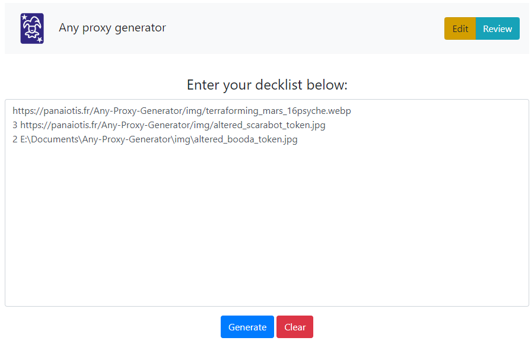

# MTG-Proxy-Generator
## Try the Live App Below:
[Any Proxy Generator](https://panaiotis.fr/MTG-Proxy-Generator/)
## How to Use:
Bored of lokking for a new website each time you want to play a proxy?
Now you can print any card using US format from this site, which can be from a trading card game or a board game.
Then you may test your deck or add custom cards to your boardgames.
## Import Decks Using Easy MTGO Syntax

## Create Proxy-Versions of Decks You'd Like to Test

## Technology Used:
This app was built with HTML, CSS, Javascript, jQuery, and Bootstrap.
